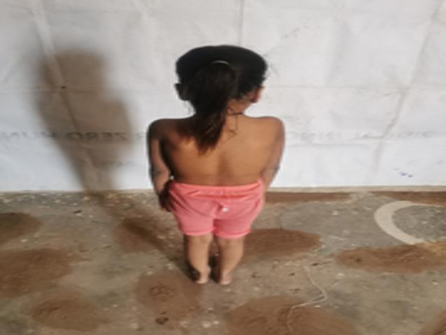

# Depth Estimation of the single images with Transfer Learning pretrained MobileNetV2

### Steps fellowed to solve the problem.
1. Read the survey paper [Single Image Depth Estimation: An Overview](https://arxiv.org/abs/2104.06456) to get the overview of the current state of art in the field.
2. Implement the paper [High Quality Monocular Depth Estimation via Transfer Learning (arXiv 2018)](https://arxiv.org/abs/1812.11941).
3. Look at the official code of the paper : [code](https://github.com/ialhashim/DenseDepth).

# Results 

| Original image                    | Original DenseDepth                | Predicted DenseDepth                   |
| ----------------------------------- | ----------------------------------- | ------------------------------------------- |
|  |  |   |
|  |  |   |
|  |  |   |
|  |  |   |
|  |  |   |
|  |  |   |
|  |  |   |

##### Structural Similarity Index (SSIM) between the above two images: 0.37290473188266604
# Data 
Downlaod the data from the link [click here](www.google.com) and put in the parent directory of the project. 

# Train the model. 

Run the command `python train.py` to train the model and save the model in `./models` directory. 

# Test the model.
Run the command `python test.py` the model the testing images is in the `./test_img_1` directory and produced DenseDepth saved in the './resutls' directory. 

# Documentation 
Documentation is present at the link : [documentation](https://vikas-rajpoot.github.io/depth_estimation/)

